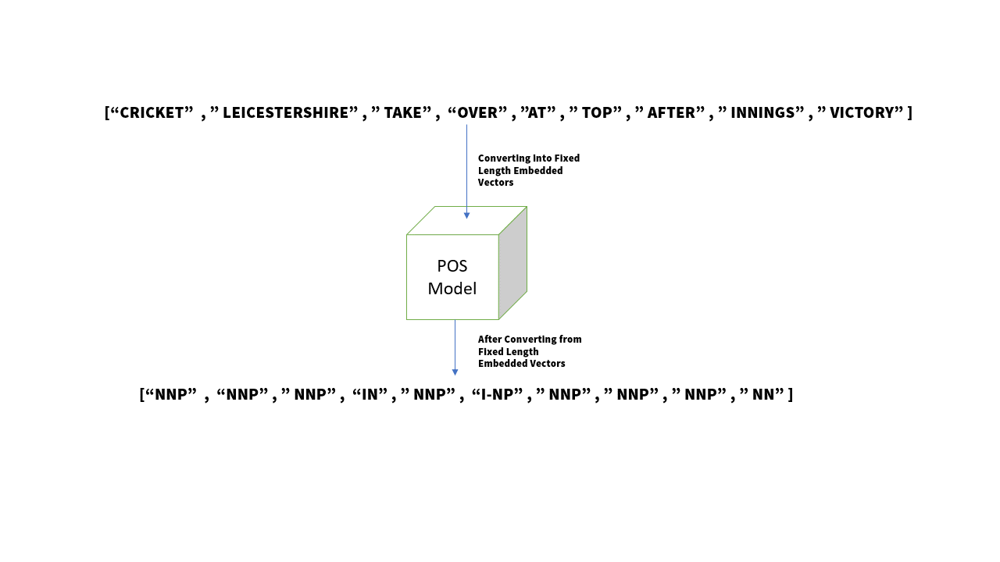

# **CoNLL-2003 Tagging Task**
In this Repository you will find 3 models different models trained on the English CoNLL-2003 dataset, which can tag the sentences into their respective POS tags, Syntactic chunk tags, and NER tags.

**Data Description**

The CoNLL-2003 shared task data files contain four columns separated by a **single space**. Each word has been put on a separate line and there is an empty line after each sentence. The first item on each line is a word, the second a **part-of-speech (POS) tag**, the third a **syntactic chunk tag**, and the fourth the **named entity tag**.

<>

Here, from the above we can see the structure of our dataset. Let, take the example of Sample 1 from where I have used Cricket as the Word, NNP as the POS tag, I-NP as the syntactic chunk tag, and O as the NER tag. In this way same to the Sample 1 I have modeled the entire training, validation, and testing dataset.

There, are 3 files using which we can train, validate and test our model-

 - eng.testa – Dataset for validating the model.
 - eng.testb – Dataset for testing the model. 
 - eng.train – Dataset for training the model.

**Installation**
To run this code in you local system you can download the required packages

