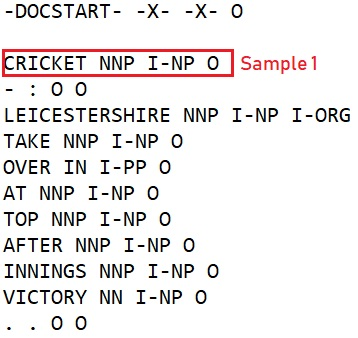

# **CoNLL-2003 Tagging Task**
In this Repository you will find 3 different models trained on the English CoNLL-2003 dataset, which can tag the sentences into their respective POS tags, Syntactic chunk tags, and NER tags.


## **Data Description**

The CoNLL-2003 shared task data files contain four columns separated by a **single space**. Each word has been put on a separate line and there is an empty line after each sentence. The first item on each line is a word, the second a **part-of-speech (POS) tag**, the third a **syntactic chunk tag**, and the fourth the **named entity tag**.




Here, from the above we can see the structure of our dataset. Let, take the example of Sample 1 from where I have used Cricket as the Word, NNP as the POS tag, I-NP as the syntactic chunk tag, and O as the NER tag. In this way same like Sample 1 I have modeled the entire training, validation, and testing dataset.

There, are 3 files using which we can train, validate and test our model.

**eng.testa** – Dataset for validating the model.

**eng.testb** – Dataset for testing the model.

**eng.train** – Dataset for training the model. 

## **File Structure**

```
Conll_task/
├── Model_Evaluation.ipynb
├── utils.py
├── eval.py
├── models.py
├── process.py
├── requirments.txt
├── README.md
├── checkpoints
│  ├── model_POS.h5
│  ├── model_chunk.h5
│  ├── model_ner.h5
├── encoding
│  ├── all_tags_NER.pkl
│  ├── all_tags_PAR.pkl
│  ├── all_tags_POS.pkl
│  ├── all_words_NER.pkl
│  ├── all_words_PAR.pkl
│  ├── all_words_POS.pkl
│  ├── MAX_LEN_NER.pkl
│  ├── MAX_LEN_PAR.pkl
│  ├── MAX_LEN_POS.pkl
│  ├── X_teste_NER.pkl
│  ├── X_teste_PAR.pkl
│  ├── X_teste_POS.pkl
│  ├── y_teste_NER.pkl
│  ├── y_teste_PAR.pkl
│  ├── y_teste_POS.pkl
├── images
│  ├── model1.png
│  ├── model2.png
│  ├── model3.png
│  ├── ner.gif
│  ├── dataset.jpeg
├── conll2003
│  ├── eng.testa
│  ├── eng.testb
│  ├── eng.train
```
## **Approach**

   1. Going through the dataset and figure out how to create a structured
     data structure for our model.
    
   2. Extracting the X and Y labels for our training, validation, and
    testing from the provided datasets using **process.py** file. I have
    used two types of data extraction functions for the models. The
    **load_data_and_labels_one** function is used to model the data for our POS tagger deep learning model and   **load_data_and_labels_two** is used for the Syntactic chunk, NER models.
    
   3. As we know that the deep learning models didn’t understand text or
    image data, they only understand numbers. Thus, I have created a
    word and tags vocabulary using the entire dataset as well as the
    maximum length of a sentence to pass a fixed-length vector to our
    model. There are sentences with different lengths, thus we can’t
    just pass the vectors of different lengths to our model. As we know
    the max length of the sentence, so we have to pad all the
    sentences according to the max length. After
    encoding and padding the sentences using the **utils.py** file we
    have to save those processed lists of X_train, X_test, X_valid,
    y_train, y_test, and y_valid in pickle files as well as the lists of
    the tags, words and max length concerning the model’s. These files
    are saved inside the encoding directory for the future usage during
    model inference and evaluation.
    
   4. Then, I have defined the model architecture inside the **models.py**
    file.
    
   5. After defining the model, its time for compiling and fitting the
    model with the required parameters as well as the training and
    validation data.
    
   6. Once the training is done using the **train.py** file the 3
    different models are saved inside the checkpoints directory.
    
   7. Now we can evaluate the model using the function present of the
    **eval.py** file inside a jupyter-notebook for a proper understanding of the model’s performance.

## **Model Architecture**

I have created 3 different models for the different tasks thus I have used a simple deep learning model architecture to train the models. We can find the model's architecture inside the `models.py` file.


**Model Summary:**


-   I have used an **embedding layer** that computes a word vector model for our words.
-   Then I have added Dropout to avoid overfitting.
-   Then an **LSTM layer** with a `Bidirectional` modifier.
-   I have set the `return_sequences=True` parameter so that the LSTM outputs a sequence, not only the final value as well as added `recurrent_dropout=0.1`.
-   After the LSTM Layer there is a **Dense Layer** (or fully-connected layer) that picks the appropriate tag. Since this dense layer needs to run on each element of the sequence, we need to add the `TimeDistributed` modifier.
-   In the last layer I have used Softmax function.
-   During compiling the model I have used `optimizer='adam', loss='categorical_crossentropy'` and `metrics=['accuracy']`.
-   I have used `save_best_only=True` to save the best model updates in the .h5 file.

## **Installation**

To run this code in your local system you have to download this repository using-

`git clone https://github.com/pranabsarkar/Conll_task.git`

Now open the downloaded directory and install the required python packages using-

`pip install -r requirements.txt`

## **Usage**

For a quick evaluation of the models, I have uploaded my models and encodings. You can download it using this link: [https://drive.google.com/drive/folders/1dZQjwpGlB7dr4cB_dBqjzxMTFZsYZPlz?usp=sharing](https://drive.google.com/drive/folders/1dZQjwpGlB7dr4cB_dBqjzxMTFZsYZPlz?usp=sharing)

** _We have to place the downloaded files in a correct orientation according to the given File Structure Graph in the above._

## **Training and Evaluation**

I have used my local system for training these deep learning models.

CPU: Intel® Core™ i5-8265U @ 1.60 GHz 1.80 GHz; RAM: 8 GB

For training, I have to use the following command-

`python train.py`

After training this model I have used the test dataset i.e. eng.testb for the model evaluation. There are 3 different models, thus there I have used a jupyter notebook to visualize the **F1 Score**, **Recall** and **Precision** for the 3 different models.

`jupyter-notebook Model_Evaluation.ipynb`

**For the POS model I got:**

Precision:  0.8316200995133687

Recall:  0.8540105000140374

F1:  0.8426665927947146

**For the Syntactic chunk Tagger model, I got:**

Precision:  0.8438677763819096

Recall:  0.869574011893685

F1:  0.8565280628001036

**For the NER Tagger model, I got:**

Precision:  0.7410989010989011

Recall:  0.8345501794332385

F1:  0.785053256504278

## **Further Modification’s:**

* We can use pre-trained word embedding’s like **GloVe** for better results.

* During text processing we can convert all the words into lowercase.

* If there is more training data the model can perform better after the training.

* We can fine-tune the hyper-parameters of our model to enhance the performance of our model.

* We could have used different model architectures and compare the performances.

## **References**

* Introduction to the CoNLL-2003 Shared Task: Language-Independent Named Entity Recognition. Link: [https://www.aclweb.org/anthology/W03-0419.pdf](https://www.aclweb.org/anthology/W03-0419.pdf)

* Dataset Link: [https://github.com/patverga/torch-ner-nlp-from-scratch/tree/master/data/conll2003](https://github.com/patverga/torch-ner-nlp-from-scratch/tree/master/data/conll2003)

* Keras Documentation. Link: [https://keras.io/guides/](https://keras.io/guides/)

* https://www.deeplearning.ai/

## **Thank You**
